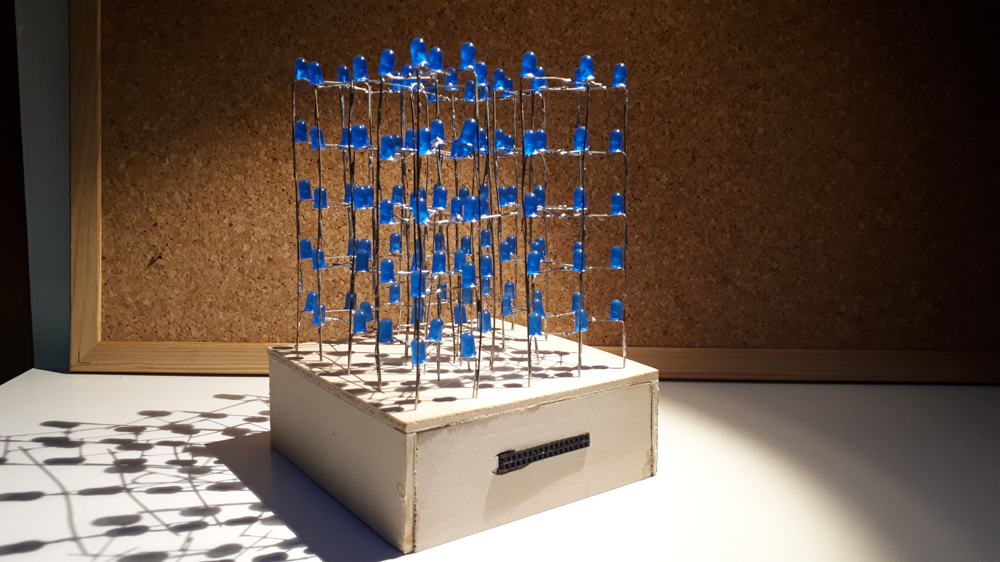
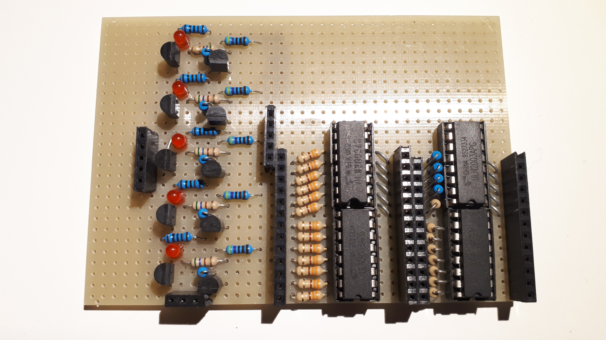
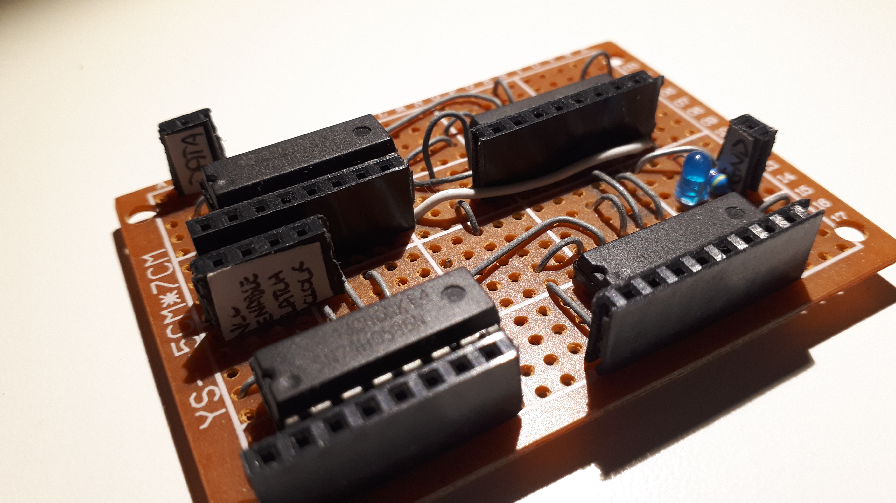
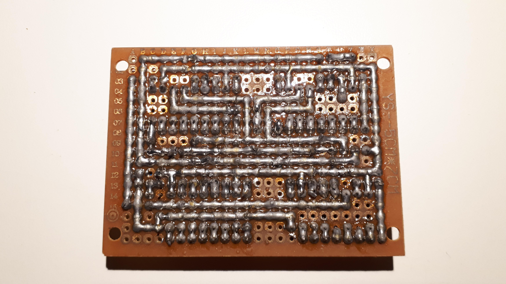

# Cubong

An Arduino library for controlling a 5x5x5 LED cube using shift registers.

## Overview

Cubong is a library designed to simplify the control of a 5x5x5 LED cube (125 LEDs total) using the Arduino platform. The library uses shift registers (SN74HC595N) for multiplexing the LED matrix, allowing you to control all 125 LEDs using only a few digital pins.

## Gallery


_5x5x5 blue led matrix_


_Power management driver_


_Logical driver - top_


_Logical driver - bottom_

## Videos

[](https://youtu.be/WauND18Tt2c)
[](https://youtu.be/z4xPvoMR7FE)

- https://youtu.be/WauND18Tt2c
- https://youtu.be/z4xPvoMR7FE

## Features

- **Simple LED Control**: Turn individual LEDs on/off using 3D coordinates (x, y, z)
- **Layer Management**: Control entire layers (planes) of the cube
- **3D Tensor System**: Use a 3D boolean array to represent the entire cube state
- **Animation Support**: Built-in functions for creating patterns and animations
- **Text Display**: Display letters (M, I, S) in the cube
- **Box Class**: Create animated objects that can move through the cube
- **Multiple Examples**: Includes 10 example sketches demonstrating various features

## Hardware Requirements

- Arduino board (Uno, Mega, or compatible)
- 5x5x5 LED cube
- 4x SN74HC595N shift registers (or more, depending on your configuration)
- ULN2003 Darlington transistor arrays for layer control
- Resistors for LEDs
- Power supply (sufficient for all LEDs)

### Shift Register Pinout (SN74HC595N)

The library is designed to work with the SN74HC595N shift register. Pin configuration:

```
1  - Q1 (Output 1)
2  - Q2 (Output 2)
3  - Q3 (Output 3)
4  - Q4 (Output 4)
5  - Q5 (Output 5)
6  - Q6 (Output 6)
7  - Q7 (Output 7)
8  - GND
9  - Q7' (Serial Data Output for cascading)
10 - Master Reset (connect to +5V)
11 - Clock
12 - Latch
13 - Output Enable (connect to GND or Arduino pin)
14 - Serial Data Input
15 - Q0 (Output 0)
16 - Vcc (+5V)
```

## Installation

### Arduino IDE

1. Download this repository as a ZIP file
2. In Arduino IDE, go to **Sketch** → **Include Library** → **Add .ZIP Library...**
3. Select the downloaded ZIP file
4. The library will be installed and available in your sketches

### Manual Installation

1. Download this repository
2. Copy the `Cubong` folder to your Arduino libraries folder:
   - Windows: `Documents\Arduino\libraries\`
   - Mac: `~/Documents/Arduino/libraries/`
   - Linux: `~/Arduino/libraries/`
3. Restart the Arduino IDE

## Quick Start

### Basic Example

```cpp
#include <Cubong.h>

// Create Cubong object
// Parameters: data, latch, clock, enable, layer0, layer1, layer2, layer3, layer4
Cubong cube(7, 6, 5, 4, 8, 9, 10, 11, 12);

void setup() {
  Serial.begin(9600);
}

void loop() {
  // Turn on a single LED at position (2, 2, 2)
  cube.led(2, 2, 2);
  delay(1000);

  // Turn off all LEDs
  cube.spengi();
  delay(1000);
}
```

## API Reference

### Cubong Class

#### Constructor

```cpp
Cubong(int data, int latch, int clock, int enable, int l0, int l1, int l2, int l3, int l4)
```

Create a Cubong object with specified pin connections.

**Parameters:**

- `data` - Serial data pin for shift register
- `latch` - Latch pin for shift register
- `clock` - Clock pin for shift register
- `enable` - Output enable pin for shift register
- `l0`, `l1`, `l2`, `l3`, `l4` - Layer control pins (0-4)

#### Core Methods

##### LED Control

- `void led(int x, int y, int z)` - Turn on a single LED at coordinates (x, y, z)
- `void piano(int z)` - Turn on all LEDs in layer z
- `void spengi()` - Turn off all LEDs
- `void spengiCubo()` - Turn off the cube (clear buffer)

##### Tensor Operations

The library uses a 3D boolean array (tensor) to represent the cube state:

- `void add(int x, int y, int z)` - Add a LED to the tensor at position (x, y, z)
- `void azzeraTensore()` - Clear the tensor (set all to 0)
- `void fillPiano(int z)` - Fill an entire layer in the tensor
- `void getTensore(bool source[][5][5])` - Copy tensor from another source

##### Display Functions

- `int accendiCubo(long int time)` - Display the tensor for specified time (milliseconds)
- `int accendiCubo2(long int time)` - Alternative display method with layer switching
- `void sendLayer(int z)` - Send a specific layer to the cube
- `int lampeggiaCubo(int ritardo, int ripetizioni)` - Blink the cube

##### Text Display

- `void letteraM(int x, int time)` - Display letter "M" at position x
- `void letteraI(int x, int time)` - Display letter "I" at position x
- `void letteraS(int x, int time)` - Display letter "S" at position x

##### Debug Functions

- `void printaTensore()` - Print tensor state to Serial
- `void printaTensore_piano(int z)` - Print specific layer to Serial
- `void printaTensore_riga()` - Print tensor in row format to Serial
- `void printaBuffer()` - Print buffer contents to Serial

### Box Class

The Box class allows you to create animated objects that can move through the cube.

#### Constructor

```cpp
Box()
```

Creates a new Box object with its own tensor.

#### Methods

- `void add(int x, int y, int z)` - Add a LED to the Box tensor
- `void addCumulativo(int x, int y, int z)` - Add LED with cumulative effect
- `void azzeraTensore()` - Clear the Box tensor
- `void move(int x, int y, int z)` - Move the Box's single LED to new position
- `void printaTensore_riga()` - Print Box tensor to Serial

#### Helper Functions

- `void sendBox(Box input, Cubong* storage)` - Transfer Box tensor to Cubong
- `Box somma(Box addendo1, Box addendo2)` - Combine two Box objects (OR operation)

## Examples

The library includes several example sketches in the `examples/` folder:

### LampeggiaCubo_Input

Demonstrates cube blinking with variable delay controlled by analog input.

### Miss

Displays the letters "MISS" on the cube with variable positioning.

### RiempiCubo

Fills the cube randomly, one LED at a time.

### SfogliaLed

Scans through individual LEDs in sequence.

### SfogliaPiani

Cycles through all five layers of the cube.

### SfogliaPiani_Vuoto

Similar to SfogliaPiani but starts with empty layers.

### SfogliaPiani_input

Layer cycling with variable speed from analog input.

### StampaTensore

Demonstrates the tensor system by printing patterns.

### StampaTensore_Piani

Shows how to build patterns layer by layer using the tensor.

### TestTensore

Tests the tensor functionality with various patterns.

## Usage Tips

1. **Power Supply**: Ensure your power supply can handle all LEDs. At full brightness, 125 LEDs can draw significant current.

2. **Refresh Rate**: The `accendiCubo()` function uses multiplexing. Call it frequently with short time intervals for smooth display.

3. **Tensor Workflow**: The typical workflow is:
   - Clear tensor: `cube.azzeraTensore()`
   - Add LEDs: `cube.add(x, y, z)`
   - Display: `cube.accendiCubo(duration)`

4. **Multiple Objects**: Use the Box class to create multiple animated objects that can be combined.

## Technical Details

### Multiplexing

The library uses time-division multiplexing to control the cube:

- Only one layer is active at a time
- The library rapidly cycles through layers (typically 5ms per layer)
- Persistence of vision creates the illusion of all LEDs being on simultaneously

### Buffer System

Internally, the library maintains:

- A 32-bit buffer for shift register output
- A 5x5x5 boolean tensor representing the cube state
- Automatic conversion from tensor to buffer format

## Contributing

Contributions are welcome! Please feel free to submit pull requests or open issues for bugs and feature requests.

## License

This project is open source. Please check with the repository owner for specific license terms.

## Credits

Created by PaperPesto

---

_Note: This library is designed for educational purposes and DIY LED cube projects. For production use, additional optimization may be required._
